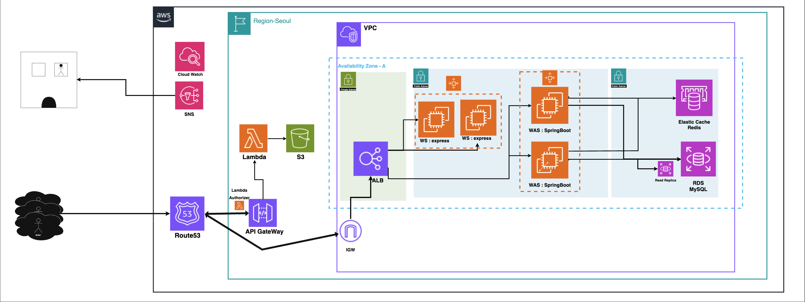

# 3-vani-kim-community
# ☁️ AWS Scalable Architecture for 1M MAU Community Service


> **Project Summary** > 100만 MAU(월간 활성 사용자)와 10만 DAU 규모의 트래픽을 가정하여, **고가용성(High Availability)** 과 **비용 효율성(Cost Efficiency)** 을 극대화한 AWS 인프라 설계 및 구축 프로젝트입니다.

---
### 관련 페이지
- **배포 URL:** [밥상머리 바로가기](https://vanicommu.click/landing)
- **관련 리포지토리:** [Front-end Github 바로가기](https://github.com/100-hours-a-week/3-vani-kim-community-FE)
---
## 🎯 Key Achievements (핵심 성과)

비즈니스 요구사항을 분석하여 정량적인 근거를 바탕으로 인프라를 설계했습니다.

* **💸 비용 최적화 (Cost Optimization)**
    * EC2 **Spot Instance**와 **AWS Graviton(ARM)** 프로세서를 도입하여 동급 x86 온디맨드 대비 **컴퓨팅 비용 약 60% 절감** 설계
    * 고가의 NAT Gateway 대신 **VPC Endpoint**를 활용하여 데이터 전송 비용 절감 및 보안 강화
* **📈 확장성 및 안정성 (Scalability & Stability)**
    * 예상 피크 트래픽(**약 2,300 QPS**)에 대응하기 위한 **Auto Scaling Group(ASG)** 및 **ALB** 구성
    * **Redis** 캐싱을 통해 '좋아요' 기능의 DB 병목(Hot Key Issue) 해결 및 응답 속도 개선
* **⚡ 서버리스 아키텍처 (Serverless)**
    * 이미지 업로드 부하를 EC2에서 분리하기 위해 **Lambda**와 **S3 Presigned URL**을 활용한 Direct Upload 구현

---

## 🏗️ Architecture Overview

단일 장애점(SPOF)을 제거하고, 퍼블릭/프라이빗 서브넷을 통한 보안 격리 구조를 적용했습니다.



> **👉 [상세 아키텍처 설계 및 기술적 의사결정 과정 보러가기 (docs/ARCHITECTURE.md)](./docs/ARCHITECTURE.md)** > *(트래픽 산정 근거, 비용 분석표, NAT Gateway 제거 이유 등 상세 내용)*

---

## 🛠️ Tech Stack & Infrastructure

| Category | Technology | Usage & Reason                                                 |
|:---:|:---:|:---------------------------------------------------------------|
| **Compute** | AWS EC2 (Spot + On-Demand) | 기본 부하는 On-Demand, 피크 트래픽은 Spot으로 비용 절감                         |
| **Serverless** | AWS Lambda (Node.js) | 이미지 업로드 권한(Presigned URL) 발급 및 가벼운 로직 처리  |
| **Network** | VPC, ALB, Route53 | 논리적 망 분리 및 트래픽 로드 밸런싱                                          |
| **Database** | Amazon RDS (MySQL) | 비용 효율성을 고려하여 Aurora 대신 MySQL 선택        |
| **Cache** | Amazon ElastiCache (Redis) | DB 부하 분산 및 세션/카운트 데이터 캐싱               |
| **Storage** | Amazon S3 | 정적 리소스 저장 및 수명 주기(Lifecycle) 정책 적용     |
| **Monitoring** | CloudWatch | CPU Credit, 메모리, DB 커넥션 등 주요 지표 모니터링   |

---

## 💻 Backend Highlights & Data Strategy

DevOps 엔지니어로서 **"배포할 애플리케이션의 특성"**을 깊이 이해하고 인프라를 설계했습니다. 단순한 CRUD가 아닌 대용량 트래픽 처리를 위한 백엔드 설계를 적용했습니다.

* **🚀 동시성 제어 (Concurrency Control)**
    * 인기 게시글의 '좋아요' 클릭 시 발생하는 DB Row Lock 병목을 해소하기 위해 **Redis Set** 기반의 캐싱 및 비동기 쓰기 전략 구현
* **🔐 Stateless 인증 아키텍처**
    * Auto Scaling 환경에서 세션 정합성 문제를 원천 차단하기 위해 **JWT** 기반 인증 시스템 구축
* **⚡ 부하 분산 설계 (Offloading)**
    * 웹 서버(Spring Boot)의 리소스를 비즈니스 로직에 집중시키기 위해, 이미지 처리 및 업로드 권한 발급 로직을 **AWS Lambda**로 분리

> **👉 [DB 설계(ERD), 캐싱 전략 등 백엔드 상세 기술 문서 보러가기 (docs/BACKEND_DESIGN.md)](./docs/BACKEND_DESIGN.md)**

---
## 📂 Project Structure

백엔드 코드의 레포지토리구조입니다.

```bash
backend/
├── src/main/java/com/vani/week4/backend/
│   ├── auth/              # 인증/인가 (JWT, 회원가입/로그인)
│   ├── user/              # 사용자 관리
│   ├── post/              # 게시글 CRUD, 배치 작업
│   ├── comment/           # 댓글 시스템
│   ├── interaction/       # 좋아요 기능
│   ├── infra/             # S3, 헬스체크
│   ├── global/            # 공통 설정, 예외 처리
│   ├── term/              # 약관 페이지
│   └── loadtest/          # 부하 테스트 데이터
│
├── src/main/resources/
│   ├── application.yml              # 기본 설정
│   ├── application-prod.yml         # 운영 환경
│   ├── application-loadtest.yml     # 부하 테스트
│   ├── static/css/                  # 스타일시트
│   └── templates/                   # 약관 HTML
│
├── src/test/                        # 단위/통합 테스트
├── Dockerfile                       # 컨테이너 이미지
├── docker-compose.yml               # 로컬 개발 환경
└── docs/                            # 아키텍처 문서
```

### 주요 도메인

- **auth**: JWT 토큰 기반 인증, 이메일/닉네임 중복 체크
- **post**: 게시글 CRUD, 커서 기반 페이지네이션, 좋아요 수 동기화 배치
- **comment**: 댓글
- **interaction**: Redis 기반 좋아요 캐싱
- **infra**: S3 presigned URL, 헬스체크

---
## 🚀 Future Roadmap: Service Expansion & Tech Challenges

단순한 커뮤니티 기능을 넘어, 비즈니스 확장에 따른 **대규모 트래픽 처리**와 **고비용 리소스(GPU) 최적화**를 위한 기술적 로드맵입니다.

### 1. AI 기반 추억 복원 서비스 (Premium Plan)
> **Scenario:** 사용자가 업로드한 부모님의 음성과 레시피 텍스트를 AI로 학습시켜, 영상/음성 메시지로 변환해주는 유료 구독 모델 도입
* **Infrastructure Challenge:**
    * **GPU Cost Optimization:** AI 모델 추론을 위한 고비용 GPU 인스턴스 비용 절감을 위해, 학습/추론 작업은 **Spot Instance**로 처리하고 중단 시 체크포인트부터 재개하는 아키텍처 설계 예정.
    * **Async Processing:** 영상 렌더링 시간이 길어짐에 따라 API Gateway 타임아웃 방지를 위해 **SQS + Lambda(Container Image) 비동기 파이프라인** 구축.

### 2. 식재료 마켓플레이스 확장 (Commerce)
> **Scenario:** 레시피 상세 화면에서 식재료 구매로 이어지는 커머스 기능 도입 및 트래픽 증대
* **Infrastructure Challenge:**
    * **Traffic Spike 대응:** 타임세일 등 트래픽 폭주에 대비해 **K6** 부하 테스트 시나리오를 고도화하고, 트래픽 패턴 분석을 통한 **Pre-warming** 전략 수립.
    * **Global Latency:** 향후 해외 배송 서비스 확장 시 **CloudFront** 캐싱 최적화 및 리전 확장(Multi-Region) 고려.

### 3. 수익화에 따른 FinOps 전략
* 수익 창출보다 선행되어야 할 것은 **인프라 비용 최적화**입니다. 현재 구성된 아키텍처(Spot Instance, ARM 프로세서 도입)를 기반으로, 서비스 확장에 따른 비용 증가폭을 최소화하여 **매출 대비 인프라 비용 비율을 10% 미만으로 방어**하는 것이 목표입니다.